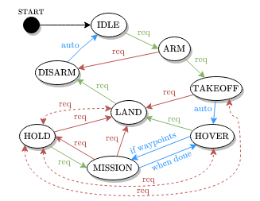

# CNS Flight Stack: Mission Sequencer

[](https://github.com/aau-cns/mission_sequencer/releases) 
[](./LICENSE) [](https://doi.org/10.1109/LRA.2022.3196117)

ROS package to sequencer mission waypoints and communicate them to the controller.

Maintainer: [Martin Scheiber](mailto:martin.scheiber@aau.at)

## Credit
This code was written by the [Control of Networked System (CNS)](https://www.aau.at/en/smart-systems-technologies/control-of-networked-systems/), University of Klagenfurt, Klagenfurt, Austria.

## License
This software is made available to the public to use (_source-available_), licensed under the terms of the BSD-2-Clause-License with no commercial use allowed, the full terms of which are made available in the `LICENSE` file. No license in patents is granted.

### Usage for academic purposes
If you use this software in an academic research setting, please cite the
corresponding [academic paper] and consult the `LICENSE` file for a detailed explanation.

```latex
@article{cns_flightstack22,
    title        = {CNS Flight Stack for Reproducible, Customizable, and Fully Autonomous Applications},
    author       = {Scheiber, Martin and Fornasier, Alessandro and Jung, Roland and Böhm, Christoph and Dhakate, Rohit and Stewart, Christian and Steinbrener, Jan and Weiss, Stephan and Brommer, Christian},
    journal      = {IEEE Robotics and Automation Letters},
    volume       = {7},
    number       = {4},
    year         = {2022},
    doi          = {10.1109/LRA.2022.3196117},
    url          = {https://ieeexplore.ieee.org/document/9849131},
    pages        = {11283--11290}
}
```

---

## Getting Started

### Prerequesites
This package is part of the [CNS Flight Stack] and thus depends on the other packages of the flight stack:
- [CNS Flight Stack: Autonomy Engine]
- [MavROS (CNS Version)]
- [PX4Bridge (CNS Version)]

Further the following libraries are required
- Eigen
- ROS noetic


### Build

As this is a ROS package, please build it within the catkin environment with

```bash
catkin build mission_sequencer
```

## Usage

The intended usage is together with the [CNS Flight Stack: Autonomy Engine], which will interact with the mission sequencer. Use the provided launchfile to start the Mission Sequencer

```bash
roslaunch mission_sequencer mission_sequencer.launch
```

The following parameters can be set to modify the sequencer's behavior:

### ROS Parameters

| ROS parameter | description | default value |
|---------------|-------------|---------------|
| `threshold_position_m`    | threshold for position upon which a WP is accepted | `0.3` |
| `threshold_yaw_rad`       | threshold for yaw upon which a WP is accepted | `0.1` |
| `takeoff_type`            | type for takeoff (`POSITION=0` or `VELOCITY=1`) | `0` |
| `takeoff_z_m`             | height for takeoff in `POSITION`-mode | `1` |
| `bound_max`               | boundaries (max) for xyz values | `[1.0,1.0,1.0]` |
| `bound_min`               | boundaries (min) for xyz values | `[-1.0,-1.0,0.0]` |
| `boundary_reference`      | reference frame for boundaries (`LOCAL` or `GLOBAL`) | `LOCAL` |
| `do_automatic_sequence`   | automatic state changes in sequencer (if used without Autonomy Engine) | `false` |
| `do_automatically_disarm` | automatically disarm when MavROS detects landing | `false` |
| `do_automatically_land`   | automatically land when last waypoint was reached | `false` |
| `wp_are_relative`         | general interpretation that waypoints are relative | `false` |
| `do_hold_at_zero_vel`     | when holding use velocity to reduce speed and hold when zero velocity reached | `true` |
| `do_predict_hold_wp`      | (_experimental_) predict hold position given current velocity | `false` |
| `topic_in_pose`           | topic name for pose subscriber | `ref/pose` |
| `topic_in_odom`           | topic name for odometry subscriber | `ref/odom` |
| `verbose`                 | (_deprecated_) enable verbose flag, replace by `ROS_DEBUG` | `false` |
| `wp_from_file`            | (_deprecated_) read waypoints from file | `false` |
| `waypoint_filename`       | (_deprecated_) filename to read waypoints from  | ` ` |

<!-- ### Default Launchfile Parameters

TODO -->

### Usage without Autonomy Engine

If required the sequencer can be used without the [CNS Flight Stack: Autonomy Engine]. The easiest way to do this is to enable the automatic sequencing, i.e. setting `do_automatic_sequence` to `true`. Then, when ready start the mission by publishing the `ARM` request:

```bash
rostopic pub /autonomy/request mission_sequencer/MissionRequest \
"{header: {seq: 0, stamp: {secs: 0, nsecs: 0}, frame_id: ''}, id: 0, request: 1}" -1
```

If the automatic sequencing shall remain disabled, one can still execute the requests manually. To do so use the above publication as a template. Further the request type definition can be found in [`msg/MissionRequest.msg`](msg/MissionRequest.msg):

```
# request type definition
uint8 UNDEF   = 0 # Not used for request, used only for MS -> A communication without a specific request
uint8 ARM     = 1 # Arming (no takeoff)
uint8 TAKEOFF = 2 # Takeoff
uint8 HOLD    = 3 # mission hold request -- blocking, hold no until a resume request
uint8 RESUME  = 4 # resume mission request
uint8 LAND    = 5 # land request
uint8 HOVER   = 6 # hover request -- non blocking, when a new waypoint is received fly to it
uint8 ABORT   = 7 # mission aborted request - safety pilot will take manual control
uint8 DISARM  = 8 # Disarming
```

### Waypoint Modification

By default the Mission Sequencer gets the waypoints from the Autonomy [CNS FlightStack: Autonomy Engine]. However, any node can publish waypoints on the `/mission_sequencer/waypoint_list` topic (message definition [`msg/MissionWaypointArray.msg`](msg/MissionWaypointArray.msg)). Here the following options exist:

| Waypoint Action | description |
|---------------|-------------|
| `CLEAR  = 0`    | clear the currently buffered list of WPs and update to the provided ones |
| `APPEND = 1`    | append the provided WPs to the currently buffered list |
| `INSERT = 2`    | insert the provided WPs at index `idx` of the currently buffered list; if the `idx` exceeds the size fo the buffered list, the provided WPs will be appended |

| Reference Frame | description |
|---------------|-------------|
| `GLOBAL  = 0`    | the provided WPs are interpreted in the 'global' navigation frame |
| `LOCAL   = 1`    | the provided WPs are interpreted w.r.t. the starting pose, i.e. 'local frame' |
| `CUR_POS = 2`    | the provided WPs are interpreted w.r.t. to the current position, i.e. added to the current position, when they are evaluated |
| `CUR_POSE = 3`   | the provided WPs are interpreted w.r.t. to the current pose (position + yaw), i.e. added to the current position and yaw, when they are evaluated |

If required for your node (obstacle detection), you can get the current list of waypoints with the service:

```console
rosservice call /mission_sequencer/getStartPose "{}"
```

## Architecture

Please refer to the [academic paper] for further insights of the Mission Sequencer.



## Known Issues

None at this point in time, please submit an issue request using the git interface if any issues arise.

## Package Layout

```[console]
/path/to/mission_sequencer$ tree -L 3 --noreport --charset unicode
.
|-- cmake
|   |-- Custom.cmake
|   `-- GetGitRevisionDescription.cmake
|-- CMakeLists.txt
|-- docs
|   |-- CMakeLists.txt
|   |-- pkg-docs
|   |   |-- CMakeLists.txt
|   |   `-- doxyfile.in
|   `-- resources
|       |-- cns_UNI_and_CNS_LOGO_uniblue.png
|       `-- cns_UNI_and_CNS_LOGO_uniblue.svg
|-- include
|   `-- mission_sequencer
|       |-- mission_sequencer.hpp
|       |-- types
|       `-- utils
|-- launch
|   `-- mission_sequencer.launch
|-- LICENSE
|-- msg
|   |-- MissionRequest.msg
|   |-- MissionResponse.msg
|   |-- MissionWaypointArray.msg
|   `-- MissionWaypoint.msg
|-- package.xml
|-- README.md
|-- src
|   |-- mission_sequencer.cpp
|   |-- mission_sequencer_node.cpp
|   `-- parser_waypoints.cpp
|-- srv
|   `-- GetStartPose.srv
`-- trajectories
    `-- test_trajectory.csv
```

---

Copyright (C) 2021-2023 Christian Brommer, Christoph Böhm, Alessandro Fornasier, Roland Jung, and Martin Scheiber, Control of Networked Systems, University of Klagenfurt, Austria.
You can contact the authors at [christian.brommer@aau.at](mailto:christian.brommer@aau.at?subject=[CNS%20Flight%20Stack]%20mission_sequencer%20package), [christoph.boehm@aau.at](mailto:christoph.boehm@aau.at?subject=[CNS%20Flight%20Stack]%20mission_sequencer%20package), [alessandro.fornasier@aau.at](mailto:alessandro.fornasier@aau.at?subject=[CNS%20Flight%20Stack]%20mission_sequencer%20package), [roland.jung@aau.at](mailto:roland.jung@aau.at?subject=[CNS%20Flight%20Stack]%20mission_sequencer%20package), [martin.scheiber@aau.at](mailto:martin.scheiber@aau.at?subject=[CNS%20Flight%20Stack]%20mission_sequencer%20package).

<!-- LINKS: -->
[CNS Flight Stack]: http://sst.aau.at/cns
[CNS Flight Stack: Autonomy Engine]: http://sst.aau.at/cns
[MavROS (CNS Version)]: https://github.com/aau-cns/mavros
[PX4Bridge (CNS Version)]: https://github.com/aau-cns/PX4-Autopilot
[academic paper]: https://ieeexplore.ieee.org/document/9849131
